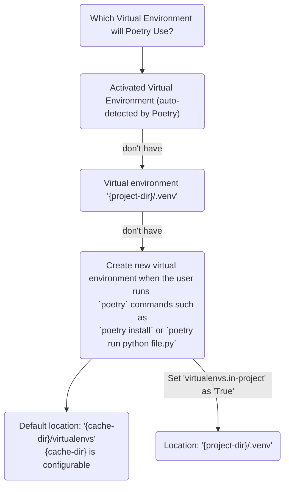

# Poetry 
(based on version 1.2)

Poetry is a tool for **dependency management** and **packaging** in Python. It allows you to declare the libraries your project depends on and it will manage (install/update) them for you. Poetry offers a lockfile to ensure repeatable installs, and can build your project for distribution.

# Table of Contents
- [Poetry](#poetry)
- [Table of Contents](#table-of-contents)
- [Objective](#objective)
- [Poetry Generated File](#poetry-generated-file)
- [Installation](#installation)
  - [Method 1: Using the official installer](#method-1-using-the-official-installer)
    - [Linux/Mac/WSL](#linuxmacwsl)
    - [Windows](#windows)
  - [Method 2: Using pipx](#method-2-using-pipx)
  - [Method 3: Manual Installation](#method-3-manual-installation)
  - [Advanced Installation](#advanced-installation)
  - [Test Installation](#test-installation)
  - [Update Poetry](#update-poetry)
  - [Enable auto-completion](#enable-auto-completion)
- [Basic Usage](#basic-usage)
  - [Initialization](#initialization)
    - [Create a new Poetry project](#create-a-new-poetry-project)
    - [Initializing a Pre-Existing Project without `requirements.txt](#initializing-a-pre-existing-project-without-requirementstxt)
    - [Initializing a Pre-Existing Project with `requirements.txt](#initializing-a-pre-existing-project-with-requirementstxt)
  - [Virtual Environment](#virtual-environment)
    - [Add dependency](#add-dependency)
      - [Method 1: Use command (recommended)](#method-1-use-command-recommended)
      - [Method 2: Manually add the dependency in `pyproject.toml`](#method-2-manually-add-the-dependency-in-pyprojecttoml)
      - [Method 3: If you cloning an existing project that use Poetry files](#method-3-if-you-cloning-an-existing-project-that-use-poetry-files)
    - [Virtual Environment that Poetry Uses](#virtual-environment-that-poetry-uses)
    - [Run Python Script](#run-python-script)
    - [Activate the Virtual Environment](#activate-the-virtual-environment)
  - [Dependencies](#dependencies)
    - [List Dependencies](#list-dependencies)
    - [Update Dependencies](#update-dependencies)
    - [Export Dependencies from `poetry.lock` to `requirements.txt`](#export-dependencies-from-poetrylock-to-requirementstxt)
- [Intermediate Usage](#intermediate-usage)
  - [Organize Dependencies by Groups](#organize-dependencies-by-groups)
    - [Dependency Group Commands](#dependency-group-commands)
      - [Add dependency to a group (`--group (-G)`)](#add-dependency-to-a-group---group--g)
      - [Install dependencies in all non-optional groups](#install-dependencies-in-all-non-optional-groups)
      - [Install but exclude or include certain dependency groups (`--without` takes precedence over `--with`)](#install-but-exclude-or-include-certain-dependency-groups---without-takes-precedence-over---with)
      - [Install only certain dependency group](#install-only-certain-dependency-group)
      - [Remove dependency from dependency group](#remove-dependency-from-dependency-group)
  - [Create Python Package](#create-python-package)
  - [Version Constraints](#version-constraints)
- [Advanced Usage](#advanced-usage)
- [Related PEP](#related-pep)


**Requirements**: Python 3.7+

# Objective
- Install Poetry
- Create new Poetry project / add Poetry to an existing project
- Understand `pyproject.toml` and `poetry.lock`
- Manage virtual environment
# Poetry Generated File
- pyproject.toml (can think of it as configuration file with a non-bloated `requirements.txt` in it)
- poetry.lock (stores all the packages and their exact versions that it downloaded)

Both file should be commited to version control.

# Installation 
Refer to [link](https://python-poetry.org/docs/#installing-with-the-official-installer).

## Method 1: Using the official installer
Available at https://install.python-poetry.org/ and is developed in [its github repository](https://github.com/python-poetry/install.python-poetry.org).

### Linux/Mac/WSL
``` bash
curl -sSL https://install.python-poetry.org | python3 -
```

### Windows
``` bash
(Invoke-WebRequest -Uri https://install.python-poetry.org -UseBasicParsing).Content | py -
```

After the installation, you might need to add the folder to the path so it can be called at anywhere. 


## Method 2: Using pipx
``` bash
pipx install poetry
```

## Method 3: Manual Installation
``` bash
python3 -m venv $VENV_PATH
$VENV_PATH/bin/pip install -U pip setuptools
$VENV_PATH/bin/pip install poetry
```

## Advanced Installation
For more advanced installations (eg: set installed location, set version), please refer to [link](https://python-poetry.org/docs/#installing-with-the-official-installer).


## Test Installation
``` bash
poetry --version
```

## Update Poetry
``` bash
poetry self update
```

``` bash
pipx upgrade poetry
```

## Enable auto-completion 
Based on [Github issue](https://github.com/python-poetry/poetry/issues/4572), the completion file has syntax error as of now. Hence, please ignore this session as of now.

Allow auto completion of poetry related command in bash shell.
``` bash
poetry completions bash >> ~/.bash_completion
```
This command will add some scripts to the file `~/.bash_completion`.

For other shell (eg: zsh, fish), please refer to the official [link](https://python-poetry.org/docs/#installing-with-the-official-installer).

Older version (<1.2) put the script at different locations.

# Basic Usage

## Initialization
### Create a new Poetry project

``` bash
poetry new poetry-playground
```

This will create a folder `poetry-playground` with the following structure.
```
poetry-playground
├── README.md
├── poetry_playground
│   └── __init__.py
├── pyproject.toml
└── tests
    └── __init__.py
```

All files are empty, except `pyproject.toml`. `pyproject.toml` orchestrate the project and its dependencies. Content of `pyproject.toml` is as follows.
```
[tool.poetry]
name = "poetry-playground"
version = "0.1.0"
description = ""
authors = ["wavetitan <wavetitango@gmail.com>"]
readme = "README.md"
packages = [{include = "poetry_playground"}]

[tool.poetry.dependencies]
python = "^3.8"


[build-system]
requires = ["poetry-core"]
build-backend = "poetry.core.masonry.api"
```

### Initializing a Pre-Existing Project without `requirements.txt
Run
``` bash
poetry init
```
This will only create a `pyproject.toml` file based on your input. It will not generate the package and test folder.
Therefore, you need to create the package folder and `REAME.md` file to run `poetry` command. Else, `poetry` will complain.

Example:
``` bash
mkdir poetry-playground2
cd poetry-playground2
poetry init
```


### Initializing a Pre-Existing Project with `requirements.txt
``` bash
poetry init
poetry add $(cat requirements.txt)
```

## Virtual Environment

### Add dependency
#### Method 1: Use command (recommended)
``` 
poetry add pandas
```
Poetry will add a file `poetry.lock` if it doesn't exist and also update `pyproject.toml`.

#### Method 2: Manually add the dependency in `pyproject.toml`
```
[tool.poetry.dependencies]
pandas = "^1.5.1"
```
After adding it to pyproject.toml, **if there isn't `poetry.lock` file**, run
``` bash
poetry install
```
This will generate a `poetry.lock` file.

**If `poetry.lock` file exists**, running `poetry install` will return warning and fail to update the dependency.
```bash
Warning: poetry.lock is not consistent with pyproject.toml. You may be getting improper dependencies. Run `poetry lock [--no-update]` to fix it.
```
Therefore, you should run
``` bash
poetry lock --no-update
poetry install
```
`poetry lock` will add the new dependencies into the `poetry.lock` based on the `pyproject.toml` file. `--no-update` will keep the existing dependencies version constant.

#### Method 3: If you cloning an existing project that use Poetry files
Run
``` bash
poetry install
```
Do note that your current project is a package too and will be install in [editable mode](https://pip.pypa.io/en/stable/topics/local-project-installs/), run with `--no-root` will avoid installing it.
``` bash
poetry install --no-root
```

### Virtual Environment that Poetry Uses
Virtual environment that Poetry uses are decided by the following


- Activated virtual environment (auto-detected by Poetry)
- The virtual environment `{project-dir}/.venv`
- Virtual environment created when the user runs `poetry` commands such as `poetry install` or `poetry run python file.py` 
  - Default location: `{cache-dir}/virtualenvs` (in my case: `/home/weiti/.cache/pypoetry/virtualenvs`)
  - Set `virtualenvs.in-project` as `True` to create within the root directory as `.venv`


### Run Python Script
It is not necessary to activate the virtual environment to use Poetry. Running `poetry run` will use the virtual environment created.

Example:
``` bash
poetry run python file.py
```

``` bash
poetry run pytest
```

### Activate the Virtual Environment
You can either 
- Run `poetry shell` to activate the virtual environment in a nested shell
- Manually activate the virtual environment

|   | POSIX SHELL | WINDOWS (POWERSHELL) | EXIT/DEACTIVATE |
|---|---|---|---|
| Sub-shell  | `poetry shell`  | `poetry shell` | `exit` |
| Manual Activation  | `source {path_to_venv}/bin/activate`  | `{path_to_venv}\Scripts\activate.ps1` | `deactivate` |
| One-liner  | `source $(poetry env info --path)/bin/activate`  | `& ((poetry env info --path) + "\Scripts\activate.ps1")` | `deactivate` |

`poetry env info --path` will return the path to the virtual environment.

## Dependencies

### List Dependencies
``` bash
poetry show
```
Return
``` bash
attrs              22.1.0    Classes Without Boilerplate
certifi            2022.9.24 Python package for providing Mozilla's CA Bundle.
charset-normalizer 2.1.1     The Real First Universal Charset Detector. Open, modern and actively maintained alternativ...
idna               3.4       Internationalized Domain Names in Applications (IDNA)
...
```

Add `--tree` will show all the dependencies as tree.
``` bash
poetry show --tree
```

Return
``` bash
numpy 1.23.4 NumPy is the fundamental package for array computing with Python.
pandas 1.5.1 Powerful data structures for data analysis, time series, and statistics
├── numpy >=1.21.0
├── numpy >=1.20.3
├── python-dateutil >=2.8.1
│   └── six >=1.5
└── pytz >=2020.1
pytest 6.2.5 pytest: simple powerful testing with Python
├── atomicwrites >=1.0
├── attrs >=19.2.0
├── colorama *
├── iniconfig *
├── packaging *
│   └── pyparsing >=2.0.2,<3.0.5 || >3.0.5
├── pluggy >=0.12,<2.0
├── py >=1.8.2
└── toml *
...
```

### Update Dependencies
Update the dependencies based on `pyproject.toml`
``` bash
poetry update
```

### Export Dependencies from `poetry.lock` to `requirements.txt`
Some situations requires `requirements.txt` file. 
Example: heroku deployment.
``` bash
poetry export --output requirements.txt
```

# Intermediate Usage

## Organize Dependencies by Groups
Poetry provides a way to **organize** dependencies by **groups**. Example: dependencies for testing, dependencies for documentation.

Dependencies across different groups will be resolved together, you should take special care to ensure that they are compatible.

Example:
Add the following to `pyproject.toml`.
``` bash
[tool.poetry.group.test]  # This part can be left out

[tool.poetry.group.test.dependencies]
pytest = "^6.2.5"
pytest-mock = "*"
```

To make an optional group, add `optional = true`.

Example:
``` bash
[tool.poetry.group.docs]
optional = true

[tool.poetry.group.docs.dependencies]
mkdocs = "*"
```

### Dependency Group Commands
#### Add dependency to a group (`--group (-G)`)
``` bash
poetry add pytest --group test
```

#### Install dependencies in all non-optional groups
You might need to run `poetry lock` before to update the `poetry.lock` file.
``` bash
poetry install
```

#### Install but exclude or include certain dependency groups (`--without` takes precedence over `--with`)
``` bash
poetry install --with docs --without test
```

#### Install only certain dependency group
``` bash
poetry install --only main
```

#### Remove dependency from dependency group
``` bash
poetry remove pytest --group test
```

## Create Python Package 
Steps:
1. Versioning - Follow [semantic versioning](https://semver.org/)
2. Packaging - Run `poetry build`
Package library in two formats, `sdist` which is a source format, and `wheel` which is a `compiled` package
3. Publishing - Run `poetry publish`
By default, Poetry will publish to [PyPI](https://pypi.org/) if you have configured your crendetial properly. To publish in a private repository, run `poetry publish -r my-repository` instead.

One can combine step 2 and 3 as `poetry publish --build`

## Version Constraints
For more info, refer to [documentation](https://python-poetry.org/docs/dependency-specification/).

Add specific version
``` bash
poetry add django@^4.0.0
```

Add latest release.
``` bash
poetry add django@latest
```

Add extras
``` bash
poetry add django[bcrypt]@^4.0.0
```

| Symbol | Meaning | Requirements | Version |
| --- | --- | --- | --- |
| Caret (^) | Allow SemVer compatible updates to a specified version | ^1.2.3 | >=1.2.3 <2.0.0 |
|  |  | ^0.0.3 | >=0.0.3 <0.0.4 | 
|  |  | ^0.0 | >=0.0.0 <0.1.0 | 
| Tilde (~) | Specify a minimal version with some ability to update | ~1.2.3 | >=1.2.3 <1.3.0 |
|  |  | ~1 | >=1.0.0 <2.0.0 | 
| Wildcard (*) | Allow for the latest (dependency dependent) version where the wildcard is positioned | 1.2.* | >=1.2.0 <1.3.0 |
|  |  | * | >=0.0.0 |
| Inequality |  | >=1.2.0 | >=1.2.0 |
|  |  | >1 | >1 |
|  |  | !=1.2.3 | != 1.2.3 |
| Multiple requirements |  | >= 1.2, < 1.5 | >= 1.2, < 1.5 |
| Exact requirements |  | ==1.2.3 | ==1.2.3 |

# Advanced Usage
[pyproject.toml](https://python-poetry.org/docs/pyproject/)
[Commands](https://python-poetry.org/docs/cli/)
[Configuration](https://python-poetry.org/docs/configuration/) (Run `poetry config --list` to see existing configuration) 
[Repositories](https://python-poetry.org/docs/repositories/) (to host the package)
[Plugins](https://python-poetry.org/docs/plugins/)

# Related PEP
- [PEP 440](https://peps.python.org/pep-0440)
- [PEP 503](https://peps.python.org/pep-0503/)
- [PEP 517](https://peps.python.org/pep-0517/#source-trees)
- [PEP 518](https://peps.python.org/pep-0518/)
