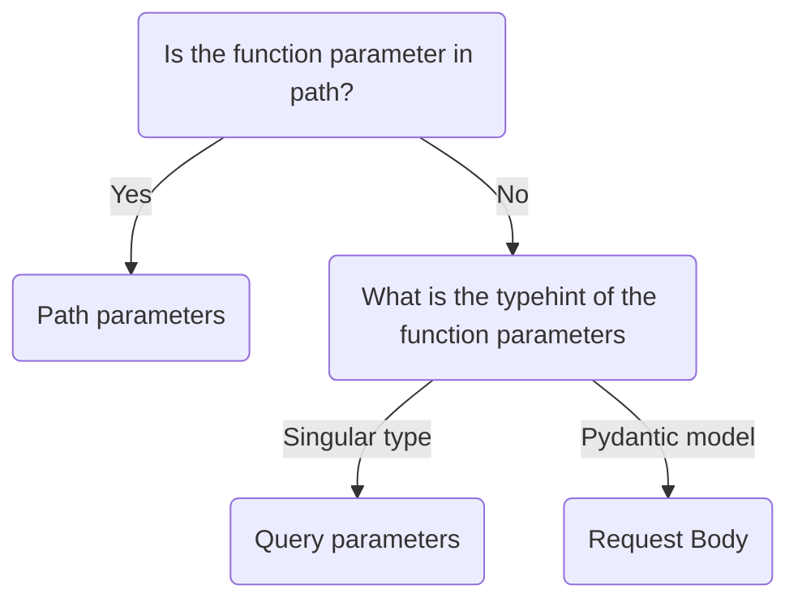

# FastAPI

Refer to [documentation](https://fastapi.tiangolo.com/)

# Table of Contents
- [FastAPI](#fastapi)
- [Table of Contents](#table-of-contents)
- [API Concepts](#api-concepts)
- [Underlying and Relevant Technology](#underlying-and-relevant-technology)
- [Default Endpoints](#default-endpoints)
- [Installation](#installation)
- [Hello World](#hello-world)
- [API Inputs](#api-inputs)
  - [Setting Predefined Value](#setting-predefined-value)
  - [Path Parameters](#path-parameters)
  - [Query Parameters](#query-parameters)
  - [Request Body](#request-body)
  - [Intermediate: Query and Path Parameters Customization](#intermediate-query-and-path-parameters-customization)
    - [Customization options](#customization-options)
    - [Make Query Parameters Required](#make-query-parameters-required)
    - [Multiple Values for Query Parameters](#multiple-values-for-query-parameters)
  - [Intermediate: Request Body](#intermediate-request-body)
    - [Singular Type Body Parameter](#singular-type-body-parameter)
    - [Multiple Request Body Parameters](#multiple-request-body-parameters)
    - [Pydantic Model Customization](#pydantic-model-customization)
    - [Nested Pydantic Models](#nested-pydantic-models)
    - [Other Pydantic Model](#other-pydantic-model)
      - [Pydantic Model as List](#pydantic-model-as-list)
      - [Pydantic Model as Arbitrary Dictionary](#pydantic-model-as-arbitrary-dictionary)
    - [Extra Data Types from Pydantic](#extra-data-types-from-pydantic)
    - [Declare Request Example](#declare-request-example)
      - [Pydantic Extra Schema](#pydantic-extra-schema)
      - [Field Additional Argument](#field-additional-argument)
      - [`example` and `examples` in OpenAPI](#example-and-examples-in-openapi)
  - [Extra Data Types](#extra-data-types)
  - [Cookie](#cookie)
  - [Header](#header)
    - [Duplicate Headers](#duplicate-headers)
  - [Form Data and Request Files](#form-data-and-request-files)
    - [Form Data](#form-data)
    - [File](#file)
      - [`UploadFile`](#uploadfile)
    - [Using both Forms and Files](#using-both-forms-and-files)
- [API Output](#api-output)
  - [Response Body](#response-body)
    - [Other Response Body Type Annotations](#other-response-body-type-annotations)
    - [Response Body Customization](#response-body-customization)
    - [Related Model](#related-model)
  - [Response Status Code](#response-status-code)
    - [Error Handling](#error-handling)
      - [Customization](#customization)
        - [Add custom header](#add-custom-header)
        - [Add custom error](#add-custom-error)
        - [Override the default exception handlers](#override-the-default-exception-handlers)
- [Other API Operations](#other-api-operations)
  - [Endpoint Level Configuration](#endpoint-level-configuration)
  - [API Level Configuration](#api-level-configuration)
  - [`PUT` and `PATCH` HTTP Operations](#put-and-patch-http-operations)
  - [Dependencies](#dependencies)
    - [Dependencies with yield](#dependencies-with-yield)
  - [Middleware](#middleware)
  - [`APIRouter`](#apirouter)
  - [Testing](#testing)
  - [Background task](#background-task)
  - [Static Files](#static-files)
  - [Security](#security)
    - [OAuth](#oauth)
  - [Cross-Origin Resource Sharing (CORS)](#cross-origin-resource-sharing-cors)
- [Miscellaneous](#miscellaneous)
  - [JSON Compatible Encoder](#json-compatible-encoder)
  - [Typehint](#typehint)
  - [Python Tricks](#python-tricks)
    - [Order Function Parameters as We Need](#order-function-parameters-as-we-need)
  - [Useful Resources](#useful-resources)

# API Concepts
- HTTP Methods/Operations
  - `POST`: to create data
  - `GET`: to read data
  - `PUT`: to update data (idempotent)
  - `PATCH`: to update data partially
  - `DELETE`: to delete data
- Path / endpoint / route
- Schema
- Server Gateway Interface
- HTTP Status Code
  - `100`: Information
  - `200`: Successful
  - `300`: Redirection
  - `400`: Client Error
  - `500`: Server Error

# Underlying and Relevant Technology
- API Schema Definition (API Paths, Possible parameters, JSON data schemas)
  - [OpenAPI](https://github.com/OAI/OpenAPI-Specification)
- [ASGI (Asynchronous Server Gateway Interface)](https://asgi.readthedocs.io/en/latest/)
  - [Starlette](https://www.starlette.io/)
- Data Validation
  - [Pydantic](https://pydantic-docs.helpmanual.io/)
- Documentation
  - [Swagger UI](https://github.com/swagger-api/swagger-ui)
  - [ReDoc](https://github.com/Rebilly/ReDoc)

# Default Endpoints
- `/docs`
- `/redoc`
- `/openapi.json`

# Installation
Create a virtual environment and run
``` bash
pip install fastapi
pip install "uvicorn[standard]"
```
If we want to install all dependencies
``` bash
pip install "fastapi[all]"
```

# Hello World
Add the following code to `main.py`
``` python
from fastapi import FastAPI

app = FastAPI()


@app.get("/")
async def root():
    return {"message": "Hello World"}
```

And run in terminal
``` bash
uvicorn main:app --reload
# main: filename
# app: fastapi object
# --reload: make the server restart after code change. Only use for development
```

# API Inputs
If the type is annotated, FastAPI will **convert** and **validate** the data input. FastAPI will raise error if the type doesn't match. FastAPI also add them to the autogenerated **documentation**.

Fastapi input-related features summary:
- Editor support
- Data 'parsing'
- Data validation
- Automatic documentation

The inputs can exist in several places:
- Path parameters
- Query parameters
- Request Body

## Setting Predefined Value 
To set the predefined value, we can define a class which inherits the [Enum](https://docs.python.org/3/library/enum.html) class. We can annotate the type of the function parameters as the defined class.

Example below also shows how `Enum` object works
``` python
class ModelName(str, Enum):  # also inherit str to ensure that the value is of type string
    alexnet = "alexnet"
    resnet = "resnet"
    lenet = "lenet"

app = FastAPI()

@app.get("/models/{model_name}") 
async def get_model(model_name: ModelName):
    print(type(model_name))  # <enum 'ModelName'>
    print(type(model_name.value))  # <class 'str'>
    print(ModelName.alexnet)  # ModelName.alexnet
    print(ModelName.alexnet.value)  # alexnet
    return model_name
```

The predefined value is documented.


## Path Parameters
Path parameters appear in path, they are required and cannot be empty. 
``` python
@app.get("/items/{item_id}")
async def read_item(item_id: int):
    return {"item_id": item_id}
```

Visit ` http://127.0.0.1:8000/items/foo` and it will return
``` python
{"item_id":"foo"}
```

## Query Parameters
Function parameters that are not part of path parameters are query parameters, they can be optional.

To make a function parameter optional, set a default value. (for type annotation, typehint it as `Union[str, None]` (or `str | None` in Python 3.10))

``` python
@app.get("/items/")
async def read_item(skip: int = 0, limit: int = 10):
    return fake_items_db[skip : skip + limit]
```
The query appears as key-value set after `?` in the URL, separated by `&` characters. For example
``` bash
http://127.0.0.1:8000/items/?skip=0&limit=10
```

We can combine multiple path and query parameters.
``` python
@app.get("/users/{user_id}/items/{item_id}")
async def read_user_item(
    user_id: int, item_id: str, text: Union[str, None] = None, short: bool = False
    ):
    return {
        "item_id": item_id, 
        "owner_id": user_id
        "message": text,
        "bool": short}
```

## Request Body
A request body is data sent by client. FastAPI uses `BaseModel` from `pydantic` to define the data model. FastAPI will read the request body as JSON. Request body can be optional.
``` python
from pydantic import BaseModel

class Item(BaseModel):
    name: str
    description: Union[str, None] = None
    price: float
    tax: float

app = FastAPI()

@app.post("/item/")
async def create_item(item: Item):
    item_dict = item.dict()
    if item.tax:
        total_price = item.price + item.tax
    return {"total price": total_price}
```

The **request body** can be used with **path** and **query parameters**.
  1. Declared in path -> **path parameters**
  2. Singular type (like `int`, `float`, `str`, `bool`, etc) -> **query parameter**
  3. **Pydantic model** type -> **request body**



``` python
@app.put("/items/{item_id}")
async def create_item(item_id: int, item: Item, q: Union[str, None] = None):
    result = {"item_id": item_id, **item.dict()}
    if q:
        result.update({"q": q})
    return result
```

## Intermediate: Query and Path Parameters Customization
We can set the default value of the function parameters as a `Query` or `Path` object. As it is an object, it comes with more customizations options. (both are subclass of `Param` class, which is subclass of Pydantic's `FieldInfo` class.)

We should use it with `Annotated` in type.
``` python
from fastapi import FastAPI, Path, Query
from typing import Union
from typing_extensions import Annotated

@app.get("/items/{item_id}")
async def read_items(
    item_id: Annotated[int, Path(title="Item ID")],
    q: Annotated[Union[str, None], Query(max_length=50)] = None
  ):
  return {"q": q}
```

This is the older method of FastAPI (before version `0.95.0`) which set the default value as the `Query` and `Path` object. It might not work if you call the function without FastAPI. You will need to pass the arguments to the functions.
``` python
from fastapi import FastAPI, Path, Query

@app.get("/items/{item_id}")
async def read_items(
    item_id: int = Path(title="Item ID")
    q: Union[str, None] = Query(default=None, max_length=50)
  ):
  return {"q": q}
```

### Customization options
`Query` and `Path` has the following arguments:
- `default`
- For string
  - `min_length`
  - `max_length`
  - `regex` (e.g."^exact_match*")
- For number
  - `ge` (greater equal)
  - `le` (less equal)
  - `gt` (greater than)
  - `lt` (less than)
- Other metadata
  - `title`
  - `description`
  - `alias` (can be used when the query name in URL is not valid Python variable name)
  - `deprecated=True`
  - `include_in_schema=False` (exclude from OpenAPI schema and documentation)

``` python
@app.get("/items/{item_id}")
async def read_items(
      q: Annotated[str, Query(title="Title", min_length=1)],
      item_id: Annotated[int, Path(gt=0, le=100)] = 50
    ):
    return {"q": q}
```

### Make Query Parameters Required
To make query parameters required, modify the typehint to not accept `None`, and don't set `default` in `Query` object.

Else, if the query parameters can accept `None`, do one of the following: 
- Set `default=...` (so called Ellipsis in Python)
- Run `from pydantic import Required` and set `default=Required`

``` python
@app.get("/items")
async def read_items(q: Annotated[int, Query(gt=0, lt=100)] = ...):
    return {"q": q}
```

### Multiple Values for Query Parameters
Set the typehint as a `List`. (Need to set default value as `Query` object to avoid fastapi identifying it as request body)

``` python
@app.get("/items")
async def read_items(q: Annotated[Union[List[str], None], Query()] = None):
    return {"q": q}
```
URL will look like
``` bash
http://localhost:8000/items/?q=foo&q=bar
```
Reponse
``` bash
{
  "q": [
    "foo",
    "bar"
  ]
}
```

## Intermediate: Request Body
### Singular Type Body Parameter
If we want to make a singular type parameter (`int`, `str`, etcs) a body parameter instead of a query parameter, we can use `Body`. It provides the same customizations and validations as `Query` and `Path`.
``` python
@app.post("/items")
async def update_item(price: Annotated[int, Body()]):
    return price
```
It will expect a single integer as request body in this case (e.g. `10`).

If there is only 1 singular type body parameters, it might be better to add `embed=True` to embed the body parameter.
``` python
@app.post("/items")
async def update_item(price: Annotated[int, Body(embed=True)]):
    return price
```

The expected FastAPI input will be like
``` python
{
  "price": 0
}
```

### Multiple Request Body Parameters
We can declare multiple body parameter.

``` python
class Item(BaseModel):
    name: str
    description: Union[str, None] = None

class User(BaseModel):
    username: str
    full_name: Union[str, None] = None

@app.put("/items/{item_id}")
async def update_item(item_id: int, item: Item, user: User, price: Annotated[int, Body()]):
    results = {"item_id": item_id, "item": item, "user": user}
    return results
```
When there are multiple body parameters,FastAPI will use the parameter names as keys of the request body . An example of valid inputs:
``` python
{
    "item": {
        "name": "Foo",
        "description": "The fighter"
    },
    "user": {
        "username": "wave",
        "full_name": "Wave"
    },
    "price": 100
}
```

### Pydantic Model Customization
We can set the default value of the function parameters as a `Field` object. It provides the same customizations and validations as `Query`, `Path` and `Body`. (note that `Field` is imported from `Pydantic` instead of `fastapi`.)
``` python
from pydantic import BaseModel, Field

class Item(BaseModel):
    name: str
    description: Union[str, None] = Field(default=None, max_length=300)
```

### Nested Pydantic Models
We can typehint the attribute of `Pydantic` model with another `Pydantic` model object.

``` python
class Image(BaseModel):
    url: str
    name: str

class Item(BaseModel):
    name: str
    image: Union[Image, None] = None
```

An example of FastAPI expected input:
``` python
{
    "name": "Foo",
    "image": {
        "url": "http://example.com/baz.jpg",
        "name": "The Foo live"
    }
}
```

### Other Pydantic Model
#### Pydantic Model as List
Typehint the parameter using `List`.
``` python
class Image(BaseModel):
    url: HttpUrl
    name: str

@app.post("/images/multiple/")
async def create_multiple_images(images: List[Image]):
    return images
```

#### Pydantic Model as Arbitrary Dictionary
Typehint the parameter using `Dict`. Example: `Dict[str, float]` will accept str key and float value.
``` python
@app.post("/index-weights/")
async def create_index_weights(weights: Dict[str, float]):
    return weights
```

### Extra Data Types from Pydantic
Refer to [Pydantic documentation](https://pydantic-docs.helpmanual.io/usage/types/)

Example:
``` python
from pydantic import BaseModel, HttpUrl

class Image(BaseModel):
    url: HttpUrl
    name: str
```
### Declare Request Example
There are 3 ways to add example for request body.
#### Pydantic Extra Schema
``` python
class Item(BaseModel):
    name: str
    price: float

    class Config:
        schema_extra = {
            "example": {
                "name": "FastAPI",
                "price": 26.8
            }
        }

```
Check out [Pydantic schema customization](https://pydantic-docs.helpmanual.io/usage/schema/#schema-customization) for more information.

#### Field Additional Argument
``` python
class Item(BaseModel):
    name: str = Field(example="FastAPI")
    price: float = Field(example=26.8)
```

#### `example` and `examples` in OpenAPI
``` python
@app.post("/items")
async def update_item(item: Annotated[Union[Item, None], Body(
    example={
        "name": "FastAPI",
        "price": 26.8
    }
)]):
    return item
```

``` python
@app.post("/items")
async def update_item(item: Annotated[Union[Item, None], Body(
    examples={
        "first": {
            "summary": "first example",
            "description": "first description",
            "value": {
                "name": "FastAPI",
                "price": 26.8
            }
        },
        "invalid": {
            "summary": "example with invalid data",
            "value": {
                "name": "FastAPI",
                "price": "twenty six point eight"
        }
        }
    }
)]):
    return item
```


## Extra Data Types
Refer to [link](https://fastapi.tiangolo.com/tutorial/extra-data-types/).
Example:
- `UUID`
- `datetime.datetime`
- `datetime.timedelta`

## Cookie
`Cookie` provides the same customizations and validations as `Query` and `Path`.
``` python
from fastapi import Cookie, FastAPI
from typing import Union
from typing_extensions import Annotated

app = FastAPI()

@app.get("/items/")
async def read_items(ads_id: Annotated[Union[str, None], Cookie(default=None)]):
    return {"ads_id": ads_id}
```

## Header
`Header` provides the same customizations and validations as `Query` and `Path`.
``` python
from fastapi import FastAPI, Header

app = FastAPI()

@app.get("/items/")
async def read_items(user_agent: Annotated[Union[str, None], Header(default=None)]):
    return {"User-Agent": user_agent}
```
Characteristics of headers:
- Usually standard headers are separated by a "hyphen" character (`-`)
- Case-insensitive
- Some HTTP proxies and server disallow the usage of headers with underscores
- Custom header can be added using the `X-` prefix

By default, `Header` will convert parameter names characters from underscore (`_`) to hyphen(`-`). Add `convert_underscores=False` to disable the automatic conversion.
``` python
strange_header: Annotated[Union[str, None], Header(default=None, convert_underscores=False)]
```

### Duplicate Headers
Set the typehint as a List.
``` python
@app.get("/items/")
async def read_items(x_token: Annotated[Union[List[str], None], Header(default=None)]):
    return {"X-Token values": x_token}
```

With that, the headers can be accepted with duplicates.
``` python
X-Token: foo
X-Token: bar
```

## Form Data and Request Files
*Requirements: `pip install python-multipart`*

Data from forms is normally encoded using media type `application/x-www-form-urlencoded` when it doesn't include file, and encoded as `multipart/form-data` when the form include file.  

We cannot declare both form data and request body in the same path operation.

Both `Form` and `UploadFile` provides similar customizations and validations as `Query`, `Path` and `Body`.

### Form Data  
`Form` class inherits directly from `Body`

``` python
from fastapi import FastAPI, Form
from typing_extensions import Annotated

app = FastAPI()

@app.post("/login/")
async def login(username: Annotated[str, Form()], password: Annotated[str, Form()]):
    return {"username": username}
```

### File
`File` class inherits directly from `Form`. The file will be uploaded as 'form data'. The parameter type can be `bytes` or `UploadFile`. `UploadFile` class inherits directly from **Starlette**'s `UploadFile`.

With type `bytes`, **FastAPI** will read the file as bytes and store it in memory. (work well for small files)

With type `UploadFile`, **FastAPI** will read the file as a "spooled" file (stored in memory up to a maximum size limit, and after passing this limit it will be stored in disk). (works well for large file)

``` python
from fastapi import FastAPI, File, UploadFile
from typing import Union
from typing_extensions import Annotated

app = FastAPI()

@app.post("/files/")
async def create_file(file: Annotated[Union[bytes, None], File(description="A file read as bytes")]):
    return {"file_size": len(file)}


@app.post("/uploadfile/")
async def create_upload_file(file: UploadFile):  # don't need default value File() if specify type as UploadFile
    return {"filename": file.filename}
```


To upload multiple files
``` python
async def create_files(files: Annotated[List[bytes], File(description="Multiple files as bytes")]):
    return {"file_sizes": [len(file) for file in files]}
```

``` python
@app.post("/uploadfiles/")
async def create_upload_files(files: Annotated[List[UploadFile], File(description="Multiple files as UploadFile")]):
    return {"filenames": [file.filename for file in files]}
```

#### `UploadFile`
Attributes of `UploadFile`:
- filename: `str`
- content_type: `str` (e.g. `image/jpeg`)
- file: [SpooledTemporaryFile](https://docs.python.org/3/library/tempfile.html#tempfile.SpooledTemporaryFile)

Async methods of `UploadFile`:
- `write(data)`
- `read(size)`
- `seek(offset)`
- `close()`

In `async` path operation 
``` python
contents = await myfile.read()
```

In normal path operation, we can access the `UploadFile.file` directly
``` python
contents = myfile.file.read()
```

### Using both Forms and Files
We can define files and form fields at the same time using `File` and `Form`.
``` python
@app.post("/files/")
async def create_file(
    file: Annotated[bytes, File()], 
    fileb: Annotated[UploadFile, File()],
    token: Annotated[str, Form()]
):
    return {
        "file_size": len(file),
        "token": token,
        "fileb_content_type": fileb.content_type,
    }
```

# API Output
## Response Body
We can declare `Pydantic` model for response, just like request body. The response model should be declared as a **parameter of decorator method**, instead of path operation function return type (this helps to provide additional functionalities). It can perform field limiting.

If you have strict type checks (e.g. using `mypy`), you can declare the function return type as `Any`.

``` python
from fastapi import FastAPI
from pydantic import BaseModel, EmailStr  # pip install email-validator or pip install pydantic[email]

app = FastAPI()

class UserIn(BaseModel):
    username: str
    password: str
    email: EmailStr
    full_name: Union[str, None] = None


class UserOut(BaseModel):
    username: str
    email: EmailStr
    full_name: Union[str, None] = None


@app.post("/user/", response_model=UserOut)
async def create_user(user: UserIn):
    return user  # field limiting in action
```


Notice that the response body is filtered based on response model.

To annotate the function type instead, we need to use inheritance.
``` python
class BaseUser(BaseModel):
    username: str
    email: EmailStr
    full_name: Union[str, None] = None


class UserIn(BaseUser):
    password: str


@app.post("/user/")
async def create_user(user: UserIn) -> BaseUser:
    return user
```
Do note that `response_model` in decorator method has a higher priority compared to function return type.

### Other Response Body Type Annotations
1. Return a `Response` directly
   ``` python
   from fastapi import FastAPI, Response
   from fastapi.response import JSONResponse, RedirectResponse
   
   app = FastAPI()

   @app.get("/portal")
   async def get_portal(redict: bool = False) -> Response:
       if redict:
           return RedirectResponse(url="https://www.youtube.com/watch?v=dQw4w9WgXcQ")
       return JSONResponse(content={"message": "Here is your message"})
   ```
2. Return a `Response` subclass (e.g. `RedirectResponse`)
   ``` python
   @app.get("/portal")
   async def get_portal() -> RedirectResponse:
       return RedirectResponse(url="https://www.youtube.com/watch?v=dQw4w9WgXcQ")
   ```
3. Disable response model (to disable validation by FastAPI)
   ``` python
   @app.get("/portal", response_model=None)
   async def get_portal() -> Union[Response, dict]:
       if redict:
           return RedirectResponse(url="https://www.youtube.com/watch?v=dQw4w9WgXcQ")
       return content={"message": "Here is your message"}
   ```

### Response Body Customization
`FastAPI` has a lot of field customizations which can be used in `decorator method` (from [Pydantic](https://pydantic-docs.helpmanual.io/usage/exporting_models/#modeldict)):
- `response_model_exclude_unset=True` - whether fields which were not explicitly set when creating the model should be excluded from the returned dictionary
- `response_model_exclude_defaults=True` - whether fields which are equal to their default values (whether set or otherwise) should be excluded from the returned dictionary
- `response_model_exclude_none=True` - whether fields which are equal to `None` should be excluded from the returned dictionary

One can also use the following parameters to include and exclude fields. However, it is recommended to defining multiple `Pydantic` models, instead of using these parameters.
- `response_model_include={set of str}`
- `response_model_include={set of str}`
- `response_model_by_alias`

Example of using `response_model_exclude_unset=True`
``` python
class Item(BaseModel):
    name: str
    description: Union[str, None] = "Default description"
    price: float

items = {
    "foo": {"name": "Foo", "price": 26.8}
}

@app.get("/items/{item_id}", response_model=Item, response_model_exclude_unset=True)
async def read_item(item_id: str):
    return items[item_id]
```
In this case, `/items/foo` will not return the default value as there are unset.
```
{"name": "Foo", "price": 26.8}
```

### Related Model
Related model (e.g. input with password, stored in database encypted password, output without password). We can use inheritance to reduce repeated code. When creating a new object using the Pydantic model class, extra input will be ignored.

``` python
from typing import Union

from fastapi import FastAPI
from pydantic import BaseModel, EmailStr

app = FastAPI()

class UserBase(BaseModel):
    username: str

class UserIn(UserBase):
    password: str

class UserOut(UserBase):
    pass


class UserInDB(UserBase):
    hashed_password: str

def fake_save_user(user_in: UserIn):
    hashed_password = user_in.password + '123'
    user_in_db = UserInDB(**user_in.dict(), hashed_password=hashed_password)
    return user_in_db

@app.post("/user/", response_model=UserOut)
async def create_user(user_in: UserIn):
    user_saved = fake_save_user(user_in)
    return user_saved
```

## Response Status Code
We can specify the HTTP status code used for the response with the parameter `status_code` in the decorator. It can receive numeric status code, [http.HTTPStatus](https://docs.python.org/3/library/http.html#http.HTTPStatus) object or `fastapi.status` object (e.g. `fastapi.status.HTTP_201_CREATED`) or `starlette.status` object
``` python
@app.post("/items/", status_code=201)
async def create_item(name: str):
    return {"name": name}
```


### Error Handling
We can raise an error in the response to notify the client that there are problems (e.g. not enough privilege, non-existent item). To return HTTP responses with errors to the client, we can use `HTTPException`.
``` python
from fastapi import FastAPI, HTTPException

app = FastAPI()

items = {"foo": "The Foo Wrestlers"}

@app.get("/items/{item_id}")
async def read_item(item_id: str):
    if item_id not in items:
        raise HTTPException(status_code=404, detail="Item not found")
    return {"item": items[item_id]}
```

If `item_id` is not `foo`, it will return an error 404 with a response body.
``` shell
{
  "detail": "Item not found"
}
```

Do note that `detail` can be `dict` or `list` too.

#### Customization
##### Add custom header
Add `headers` in the `Exception` class.
``` python
async def read_item_header(item_id: str):
    if item_id not in items:
        raise HTTPException(
            status_code=404,
            detail="Item not found",
            headers={"X-Error": "There goes my error"},
        )
    return {"item": items[item_id]}
```

##### Add custom error
1. Create the custom exception object inheriting from class `Exception` 
2. Create an exception handler function using decorator `app.exception_handler`
3. Raise the error in the code
``` python
from fastapi import FastAPI, Request
from fastapi.responses import JSONResponse

class NewException(Exception):
    def __init__(self, name: str):
        self.name = name

app = FastAPI()

@app.exception_handler(NewException)
async def new_exception_handler(request: Request, exc: NewException):
    return JSONResponse(status_code=408, content={"message": f"Problem with {exc.name}"})

@app.get("/new/{name}")
async def get_item(name: str):
    if name == "newname":
        raise NewException(name=name)
    return name
```

Running `/new/newname` will return the following error with code `408`
``` shell
{
  "message": "Problem with newname"
}
```

##### Override the default exception handlers
FastAPI has some default exception handlers with default JSON responses. These handlers can be overwritten.
1. Create an exception handler function using decorator `app.exception_handler` for the default exception
2. Raise the error in the code

Example: Override `RequestValidationError` and `StarletteHTTPException`
``` python
from fastapi import FastAPI, HTTPException, status
from fastapi.encoders import jsonable_encoder
from fastapi.exceptions import RequestValidationError
from fastapi.responses import JSONResponse, PlainTextResponse
from starlette.exceptions import HTTPException as StarletteHTTPException

@app.exception_handler(StarletteHTTPException)
async def http_exception_handler(request, exc):
    return PlainTextResponse(str(exc.detail), status_code=exc.status_code)

@app.exception_handler(RequestValidationError)
async def validation_exception_handler(request, exc):
    return JSONResponse(
        status_code=status.HTTP_422_UNPROCESSED_ENTITY,
        content=jsonable_encoder({"details": exc.errors(), "body": exc.body})
    )

@app.get("items/{item_id}")
async def read_item(item_id: int):
    if item_id == 3:
        raise HTTPException(status_code=418, detail="What")
    return {"item_id": item_id}
```
Go to `/item/foo` will return
``` shell
1 validation error
path -> item_id
  value is not a valid integer (type=type_error.integer)
```

You can also access existing exception handlers from `fastapi.exception_handlers`
``` python
from fastapi.exception_handlers import (
    http_exception_handler, 
    request_validation_exception_handler
)

...

@app.exception_handler(StarletteHTTPException)
async def custom_http_exception_handler(request, exc):
    print("HTTP ERROR!")
    return await http_exception_handler(requst, exc)
```

Do note that we are handling `HTTPException` from Starlette instead of `HTTPException` from FastAPI. The `HTTPException` from FastAPI and Starlette are different. Handling Starlette's `HTTPException` enables better support from Starlette.


# Other API Operations
## Endpoint Level Configuration
The path operation decorator accepts the following arguments
- `status_code`
- `tags` (can be used by Enums)
- `summary`
- `description` (can be replaced with docstring, FastAPI will automatically detect it)
- `response_description` (default: *Successful response*)
- `deprecated`

``` python
from enum import Enum
from fastapi import FastAPI, status
from pydantic import BaseModel
from typing import Union

app = FastAPI()

class Item(BaseModel):
    name: str
    description: Union[str, None] = None

class Tags(Enum):
    items = "items"
    users = "users"

@app.post(
    "/items", 
    response_model=Item, 
    status_code=status.HTTP_201_CREATED, 
    tags=[Tags.items],
    summary="Create an item",
    deprecated=False,
    response_description="Item created")
async def create_item(item: Item):
    """
    Create an item with these attributes
    - name
    - description
    """
    return item
```


## API Level Configuration
`FastAPI` accepts the following arguments
- `title`
- `description`
- `version`
- `term_of_service`
- `contact`
- `license_info`
- `openapi_tags` - to create metadata for tags
- `openapi_url` (e.g. `/api/v1/openapi.json`, `None`)
- `doc_url`
- `redoc_url`

``` python
from fastapi import FastAPI


description = """
# Description

Endpoint: users, items
"""

app = FastAPI(
    title="A FastAPI App",
    description=description,
    version="0.0.1",
    term_of_service="htttps://example.com/terms",
    contact={
        "name": "Bob",
        "url": "https://example.com/contact",
        "email": "bob@example.com"
    },
    license_info={
        "name": "Apache 2.0",
        "url": "https://www.apache.org/licenses/LICENSE-2.0.html"
    }
)
```
Add metadata for tags
``` python
tags_metadata = [
    {
        "name": "users",
        "description": "Operations with users. The **login** logic is also here.",
    },
    {
        "name": "items",
        "description": "Manage items. So _fancy_ they have their own docs.",
        "externalDocs": {
            "description": "Items external docs",
            "url": "https://fastapi.tiangolo.com/",
        },
    },
]

app = FastAPI(openapi_tags=tags_metadata)

@app.get("/users/", tags=["users"])
async def get_users():
    return [{"name": "Harry"}, {"name": "Ron"}]


@app.get("/items/", tags=["items"])
async def get_items():
    return [{"name": "wand"}, {"name": "flying broom"}]
```


## `PUT` and `PATCH` HTTP Operations
`PUT` creates a new resource or replaces a representation, `PATCH` applies partial modifications to a resource. For example, they can be used to update a database.
``` python
items = {"foo": {"name": "Foo"}}

@app.put("/items/{item_id}", response_model=Item)
async def update_item(item_id: str, item: Item):
    update_item_encoded = jsonable_encoder(item)
    items[item_id] = update_item_encoded
    return update_item_encoded
```

As `PATCH` is less known, many people use `PUT` even for partial update. Both will work, we need to exclude default input value (if there are any) and only update the user input value. `exclude_unset` can be useful for this.
``` python
@app.patch("/items/{item_id}", response_model=Item)
async def update_item(item_id: str, item: Item):
    old_item = item[item_id]
    old_item_model = Item(**old_item)
    update_data = item.dict(exclude_unset=True)
    updated_item = old_item_model.copy(update=update_data)
    items[item_id] = jsonable_encoder(update_item)
    return update_item
```

We use Pydantic model `copy()` with `update` parameter to update the data.


## Dependencies
*Dependencies injection* - a way for your code to declare things that it requires to work

This can be useful for shared logic or resources, enforce security.

We can do this in FastAPI using `Depends()` and pass in the dependency/dependable callable (function/class).

``` python
from fastapi import Depends, FastAPI
from typing_extensions import Annotated

async def common_parameters(start: int = 0):
    return {"start": start}

CommonsDep = Annotated[dict, Depends(common_parameters)]

@app.get("/item")
async def read_items(commons: CommonsDep):
    return commons

@app.get("/users/")
async def read_users(commons: CommonsDep):
    return commons
```

Using class as dependency
``` python
class Cat:
    def __init__(self, name: str, sound: str):
        self.name = name
        self.sound = sound

@app.get("/cats/")
async def read_cats(cat: Annotated[Cat, Depends(Cat)]):
    response = {}
    if cat.sound:
        response.update({"sound": cat.sound})
    return response
```
Instead of writing `cat: Annotated[Cat, Depends(Cat)]`, we can write it as `cat: Annotated[Any, Depends(Cat)]` (not encouraged) or `cat: Annotated[Cat, Depends()]`.

We can put dependency in path operation.
``` python
@app.get("/cat", dependencies=[Depend(Cat), Depend(Dog)])
async def read_cat_and_dog():
    return "There are cats and dogs"
```

Or add it directly to a `FastAPI` application.
``` python
app = FastAPI(dependencies=[Depends(verify_token), Depends(verify_key)])
```

We can create dependencies that have sub-dependencies, as many levels as we want.

`Depends` accepts argument `use_cache`, we can set it as `False` to avoid cache if we are using a dependency multiple time.

Dependencies are executed at the following order (router dependencies -> path decorator dependencies -> Normal parameter dependencies)

### Dependencies with yield
FastAPI supports dependencies that do some extra steps after finishing (e.g. exit, close database). Add `yield` to a dependencies function to achieve that. 

The code before `yield` statement will be run before sending a response, `yield` is what is injected into the path operations, while the code after `yield` will be run after the response have been delivered (background task).

Using `try` allows us to catch any exception during the request and handle the exit steps properly.
``` python
async def get_db():
    db = DBSession()
    try:
        yield db
    finally:
        db.close()
```

As the code after `yield` runs after the response have been delivered, it is not able to raise request-related error such as `HTTPException`.

You can also create custom context manager object and use it as FastAPI dependency.
``` python
class MySuperContextManager:
    def __init__(self):
        self.db = DBSession()

    def __enter__(self):
        return self.db

    def __exit__(self, exc_type, exc_value, traceback):
        self.db.close()


async def get_db():
    with MySuperContextManager() as db:
        yield db
```

## Middleware
A *middleware* is a functions that works with every **request before it is processed** by any specific path operation, and with every **response before returning it**.

A middleware can be created using decorator `@app.middleware("http")` for function which accepts the `Request` and a function `call_next`, which call the path operation. An example is to calculate the time taken to run a request.
``` python
import time

from fastapi import FastAPI, Request

app = FastAPI()

@app.middleware
async def add_process_time_header(requesr: Request, call_next):
    start_time = time.time()
    response = await call_next(response)
    response.headers["X-Process-Time"] = str(time.time() - start_time)
    return response
```

Note: exit code of dependencies with `yield` will run after middleware, background task will be run after all middleware

## `APIRouter`
As the application get bigger, we might want to separate the path operations into module (e.g. users, items).

We can use `APIRouter` instead of `FastAPI` to declare the path operations. We can add additional arguments to the `APIRouter`. E.g. in the file `app/routers/users.py`
``` python
from fastapi import APIRouter

router = APIRouter(prefix="/users", tags=["users"])

@router.get("/users")
async def read_users():
    return "Rick"
```

In another file `app/routers/items.py`
``` python
from fastapi import APIRouter

router = APIRouter(
    prefix="/items",
    tags=["items"],
    dependencies=[Depends(get_token_header)],
    response={404: {"description": "Not found"}}
)

@router.get("/items", tag=["custom"])
async def read_items():
    return "Potato"
```

After that, in `app/main.py`, use `app.include_router()` to include the router to the API.
``` python
from fastapi import Depends, FastAPI
from app.routers import items, users

app = FastAPI()

app.include_router(items.router)
app.include_router(users.router)
```

We can specify the router attributes in `app.include_router` instead of `APIRouter`. This can be helpful when we cannot modify the `APIRouter` file directly.
``` python
app.include_router(
    admin.router,
    prefix="/admin,
    tag=["admin"]
    )
```

A router can also be included multiple times with different prefix (e.g. when having different API versions). `APIRouter` can also be included in another `APIRouter`.

## Testing
*Requirements: `pip install httpx`*

FastAPI uses [pytest](https://docs.pytest.org/en/latest/).

Step:
1. Create a `TestClient` by passing the FastAPI application to it. The syntax of `TestClient` is similar to Requests
2. Create functions with name starting with `test_`, use `assert` to test
``` python
from fastapi import FastAPI
from fastapi.testclient import TestClient

app = FastAPI()

users = {"foo": {"name": "Foo"}}

class User(BaseModel):
    name: str

@app.get("/")
async def read_main():
    return {"message": "Hello World"}

@app.post("/users")
async def add_user(user: User):
    users[user.id] = user
    return user

client = TestClient(app)

def test_read_main():
    response = client.get("/")
    assert response.status_code == 200
    assert response.json() == {"message": "Hello World"}

def test_add_user():
    response = client.post("/users", json={"name": "Bob"})
    assert response.json() == {"name": "Bob"}
```

Noted that we are not using `async` for testing. Usually, test will be separated from the application code.


## Background task
You can define background tasks (e.g. send email, slow processing data) to be run after returning a response using `BackgroundTasks` and `add_task`.

``` python
from fastapi import BackgroundTasks, FastAPI

app = FastAPI()

def write_notification(email: str, message=""):
    with open("log.txt", mode="w") as email_file:
        email_file.write(f"{email}: {message}")

@app.post("/send-notification/{email}")
async def send_notification(email: str, background_tasks: BackgroundTasks):
    background_tasks.add_task(write_notification, email, message="some notification")
    return {"Message": "Notification sent in the background"}
```

Background tasks can also be added to the dependency function.

For heavy background task, consider using [Celery](https://docs.celeryq.dev/en/stable/).


## Static Files
We can serve static files automatically from a directory using `StaticFiles`. The OpenAPI and docs will not include anything from the mounted application.

``` python
from fastapi import FastAPI
from fastapi.staticfiles import StaticFiles

app = FastAPI()

app.mount("/static", StaticFiles(directory="static"), name="static")
```

## Security
OpenAPI define the following security schema.
- `apiKey` (from: query parameter, header, cookie)
- `http` (`bearer`, HTTP basic authentication, HTTP Digest)
- `oauth2` (called "flows", `implicit`, `clientCredentials`, `authorizationCode`, `password`)
- `openIdConnect`

### OAuth
*Requirements: `pip install python-multipart`* (OAuth use form data for sending `username` and `password`)

Example of using `OAuth2PasswordBearer` for OAuth password flow:

Workflow:
1. The user type the `username` and `password`, which will be sent to token URL to generate a token
2. The token will be sent as a header `Authorization` with a value of `Bearer` plus the token
``` python
from fastapi import Depends, FastAPI
from fastapi.security import OAuth2PasswordBearer
from typing_extensions import Annotated

app = FastAPI()

oauth2_scheme = OAuth2PasswordBearer(tokenUrl="token")  # 'token' refer to relative URL

@app.get("/items/")
async def read_items(token: Annotated[str, Depends(oauth2_scheme)]):  #oauth2_scheme is a callable
    return {"token": token}
```

Library: [`python-jose`](https://github.com/mpdavis/python-jose), `passlib`


## Cross-Origin Resource Sharing (CORS)
*Cross-Origin Resource Sharing (CORS)* is a HTTP-header based mechanism that allows a server to indicate any origins other than its own from where a browser should permit loading resources. E.g. a frontend (`https://domain-a.com`) running in a browser has JavaScript code that communicate with a backend (`https://domain-b.com`) with a different "origin" than the frontend.

An *origin* is a combination of protocol (`http`, `https`), domain and port. E.g. `https://localhost`.

Steps
1. Frontend send an HTTP `OPTIONS` request to the backend.
2. Backend has a list of "allowed origin", if the origin of frontend is in the list, backend sends the appropriate headers authorizing the communication.
3. Javascript in the frontend send its request to the backend.

CORS can be configured using `add_middleware` and `CORSMiddleware`.
``` python
from fastapi import FastAPI
from fastapi.middleware.cors import CORSMiddleware

app = FastAPI()

origins = ["https://localhost", "https://localhost:8000"]

app.add_middleware(
    CORSMiddleware,
    allow_origins=origins,  # ["*"]
    allow_methods=["*"],  # Default: ["GET"]
    allow_headers=["*"]   # Default: []  (Accept, Accpe-Language, Content-Language, Content-Type are always allowed)
    # allow_origin_regex="https://.*\.example\.org",
    # allow_credentials=True  # Default: False
    # expose_headers=[]  # Default: []
    # max_age=600  # Default: 600 (max time to cache CORS response)
)

@app.get("/")
async def main():
    return {"message": "Hello World"}
```

CORS middleware response to 2 types of HTTP request
- **Simple request** - request with `Origin` header
- **CORS preflight requests** - request of method `OPTION` with `Origin` and `Access-Control-Request-Method` headers

For more in-depth explanation of CORS, visit [Mozilla CORS documentation](https://developer.mozilla.org/en-US/docs/Web/HTTP/CORS).


# Miscellaneous
## JSON Compatible Encoder
FastAPI provides a `jsonable_encoder()` function to convert a json-like object (e.g. Pydantic model) to JSON-compatible dictionary. (e.g. converting `datetime` object to `str`). It is used by FastAPI internally to convert data.

## Typehint
Different Python versions have different typehinting mechanism, as Python improve their typehinting mechanism.

Example of defining optional list with string elements:
- For Python 3.6 and above:
`q: Union[List[str], None]`

- For Python 3.9 and above:
`q: Union[list[str], None]`

- For Python 3.10 and above:
`q: list[str] | None`

Example of importing `Annotated`:
- For Python 3.6 and above:
`from typing_extensions import Annotated`

- For Python 39 and above:
`from typing import Annotated`

## Python Tricks
### Order Function Parameters as We Need
``` python
def print(*, fruit: str='apple', vege: str):
    pass
```

## Useful Resources
- [MDN Web Docs](https://developer.mozilla.org/en-US/docs/Web/HTTP)
