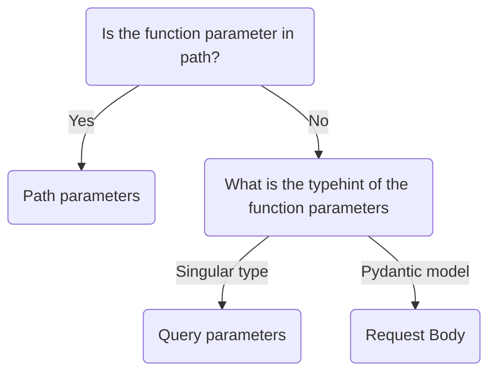

# FastAPI

Refer to [documentation](https://fastapi.tiangolo.com/)

# Table of Contents
- [FastAPI](#fastapi)
- [Table of Contents](#table-of-contents)
- [API Concepts](#api-concepts)
- [Underlying and Relevant Technology](#underlying-and-relevant-technology)
- [Default Endpoints](#default-endpoints)
- [Installation](#installation)
- [Hello World](#hello-world)
- [API Inputs](#api-inputs)
  - [Setting Predefined Value](#setting-predefined-value)
  - [Path Parameters](#path-parameters)
  - [Query Parameters](#query-parameters)
  - [Request Body](#request-body)
  - [Intermediate: Query and Path Parameters Customization](#intermediate-query-and-path-parameters-customization)
    - [Customization options](#customization-options)
    - [Make Query Parameters Required](#make-query-parameters-required)
    - [Multiple Values for Query Parameters](#multiple-values-for-query-parameters)
- [Miscellaneous](#miscellaneous)
  - [Python Tricks](#python-tricks)
    - [Order Function Parameters as you Need](#order-function-parameters-as-you-need)

# API Concepts
- HTTP Methods/Operations
  - `POST`: to create data
  - `GET`: to read data
  - `PUT`: to update data
  - `DELETE`: to delete data
- Path / endpoint / route
- Schema
- Server Gateway Interface

# Underlying and Relevant Technology
- API Schema Definition (API Paths, Possible parameters, JSON data schemas)
  - [OpenAPI](https://github.com/OAI/OpenAPI-Specification)
- [ASGI (Asynchronous Server Gateway Interface)](https://asgi.readthedocs.io/en/latest/)
  - [Starlette](https://www.starlette.io/)
- Data Validation
  - [Pydantic](https://pydantic-docs.helpmanual.io/)
- Documentation
  - [Swagger UI](https://github.com/swagger-api/swagger-ui)
  - [ReDoc](https://github.com/Rebilly/ReDoc)

# Default Endpoints
- `/docs`
- `/redoc`
- `/openapi.json`

# Installation
Create a virtual environment and run
``` bash
pip install fastapi
pip install "uvicorn[standard]"
```
If you want to install all dependencies
``` bash
pip install "fastapi[all]"
```

# Hello World
Add the following code to `main.py`
``` python
from fastapi import FastAPI

app = FastAPI()


@app.get("/")
async def root():
    return {"message": "Hello World"}
```

And run in terminal
``` bash
uvicorn main:app --reload
# main: filename
# app: fastapi object
# --reload: make the server restart after code change. Only use for development
```

# API Inputs
If the type is annotated, FastAPI will **convert** and **validate** the data input. FastAPI will raise error if the type doesn't match. FastAPI also add them to the autogenerated **documentation**.

Fastapi input-related features summary:
- Editor support
- Data 'parsing'
- Data validation
- Automatic documentation

The inputs can exist in several places:
- Path parameters
- Query parameters
- Request Body

## Setting Predefined Value 
To set the predefined value, we can define a class which inherits the [Enum](https://docs.python.org/3/library/enum.html) class. We can annotate the type of the function parameters as the defined class.

Example below also shows how `Enum` object works
``` python
class ModelName(str, Enum):  # also inherit str to ensure that the value is of type string
    alexnet = "alexnet"
    resnet = "resnet"
    lenet = "lenet"

app = FastAPI()

@app.get("/models/{model_name}") 
async def get_model(model_name: ModelName):
    print(type(model_name))  # <enum 'ModelName'>
    print(type(model_name.value))  # <class 'str'>
    print(ModelName.alexnet)  # ModelName.alexnet
    print(ModelName.alexnet.value)  # alexnet
    return model_name
```

The predefined value is documented.


## Path Parameters
Path parameters appear in path, they are required and cannot be empty. 
``` python
@app.get("/items/{item_id}")
async def read_item(item_id: int):
    return {"item_id": item_id}
```

Visit ` http://127.0.0.1:8000/items/foo` and it will return
``` python
{"item_id":"foo"}
```

## Query Parameters
Function parameters that are not part of path parameters are query parameters, they can be optional.

To make a function parameter optional, set a default value. (for type annotation, typehint it as `Union[str, None]` (or `str | None` in Python 3.10))

``` python
@app.get("/items/")
async def read_item(skip: int = 0, limit: int = 10):
    return fake_items_db[skip : skip + limit]
```
The query appears as key-value set after `?` in the URL, separated by `&` characters. For example
``` bash
http://127.0.0.1:8000/items/?skip=0&limit=10
```

We can combine multiple path and query parameters.
``` python
@app.get("/users/{user_id}/items/{item_id}")
async def read_user_item(
    user_id: int, item_id: str, text: Union[str, None] = None, short: bool = False
):
    return {
        "item_id": item_id, 
        "owner_id": user_id
        "message": text,
        "bool": short}
```

## Request Body
A request body is data sent by client. FastAPI uses `BaseModel` from `pydantic` to define the data model. FastAPI will read the request body as JSON. Request body can be optional.
``` python
from pydantic import BaseModel

class Item(BaseModel):
    name: str
    description: Union[str, None] = None
    price: float
    tax: float

app = FastAPI()

@app.post("/item/")
async def create_item(item: Item):
    item_dict = item.dict()
    if item.tax:
        total_price = item.price + item.tax
    return {"total price": total_price}
```

The **request body** can be used with **path** and **query parameters**.
  1. Declared in path -> **path parameters**
  2. Singular type (like `int`, `float`, `str`, `bool`, etc) -> **query parameter**
  3. **Pydantic model** type -> **request body**



``` python
@app.put("/items/{item_id}")
async def create_item(item_id: int, item: Item, q: Union[str, None] = None):
    result = {"item_id": item_id, **item.dict()}
    if q:
        result.update({"q": q})
    return result
```

## Intermediate: Query and Path Parameters Customization
We can set the default value of the function parameters as a `Query` or `Path` object. As it is an object, it comes with more customizations options. (both are subclass of `Param` class)
``` python
from fastapi import FastAPI, Path, Query

@app.get("/items/{item_id}")
async def read_items(
  item_id: int = Path(title="Item ID")
  q: Union[str, None] = Query(default=None, max_length=50)
  ):
  return {"q": q}
```

### Customization options
`Query` and `Path` has the following arguments:
- `default`
- For string
  - `min_length`
  - `max_length`
  - `regex` (eg:"^exact_match*")
- For number
  - `ge` (greater equal)
  - `le` (less equal)
  - `gt` (greater than)
  - `lt` (less than)
- Other metadata
  - `title`
  - `description`
  - `alias` (can be used when the query name in URL is not valid Python variable name)
  - `deprecated=True`
  - `include_in_schema=False` (exclude from OpenAPI schema and documentation)

### Make Query Parameters Required
To make query parameters required, modify the typehint to not accept `None`, and do one of the following:
- Set `default=None`
- Don't set `default`

Else, if the query parameters can accept `None`, do one of the following: 
- Set `default=...` (so called Ellipsis in Python)
- Run `from pydantic import Required` and set `default=Required`

### Multiple Values for Query Parameters
Set the typehint as a `List`. (Need to set default value as `Query` object to avoid fastapi identifying it as request body)

Example: 
``` python
async def read_items(q: Union[List[str], None] = Query(default=None)):
  return {"q": q}
```
URL will look like
``` bash
http://localhost:8000/items/?q=foo&q=bar
```
Reponse
``` bash
{
  "q": [
    "foo",
    "bar"
  ]
}
```

# Miscellaneous
## Python Tricks
### Order Function Parameters as you Need
``` python
def print(*, fruit: str='apple', vege: str):
  pass
```
